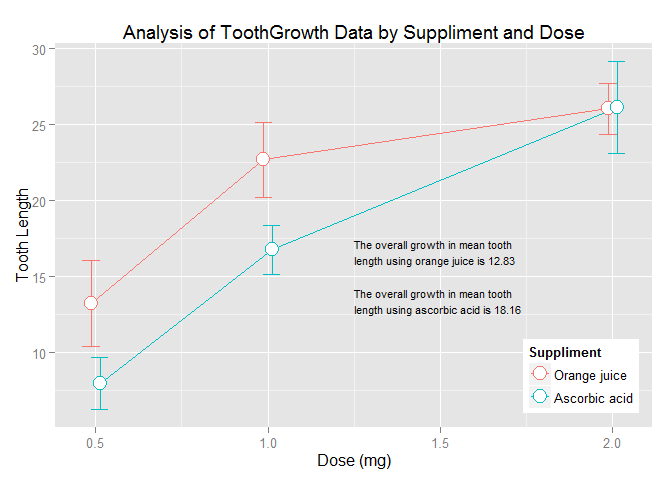

## Analysis of the ToothGrowth Data from R Datasets Package

### Overview

This project explores the *ToothGrowth* data from the R *datasets* library by
performing some preliminary analysis on the data and drawing some initial
conclusions.


### Exploratory Data Analysis


```r
library(dplyr)      # Data manipulation (filter, mutate, group_by, etc.)
library(ggplot2)    # Plotting (qplot, ggplot etc.)
library(knitr)      # Dynamic Report Creation
library(datasets)   # R included sample data sets
data(ToothGrowth)
```

To setup the analysis we load the required libraries and the *ToothGrowth* data
set.  Per the R documentation for the *datasets* package [1], *ToothGrowth* is
described as follows:

> The response is the length of odontoblasts (teeth) in each of 10 guinea pigs at each of three dose levels of Vitamin C (0.5, 1, and 2 mg) with each of two delivery methods (orange juice or ascorbic acid).


```r
str(ToothGrowth)
```

```
## 'data.frame':	60 obs. of  3 variables:
##  $ len : num  4.2 11.5 7.3 5.8 6.4 10 11.2 11.2 5.2 7 ...
##  $ supp: Factor w/ 2 levels "OJ","VC": 2 2 2 2 2 2 2 2 2 2 ...
##  $ dose: num  0.5 0.5 0.5 0.5 0.5 0.5 0.5 0.5 0.5 0.5 ...
```

```r
summary(ToothGrowth)
```

```
##       len        supp         dose      
##  Min.   : 4.20   OJ:30   Min.   :0.500  
##  1st Qu.:13.07   VC:30   1st Qu.:0.500  
##  Median :19.25           Median :1.000  
##  Mean   :18.81           Mean   :1.167  
##  3rd Qu.:25.27           3rd Qu.:2.000  
##  Max.   :33.90           Max.   :2.000
```

```r
table(ToothGrowth$supp)
```

```
## 
## OJ VC 
## 30 30
```

```r
table(ToothGrowth$dose)
```

```
## 
## 0.5   1   2 
##  20  20  20
```

```r
table(ToothGrowth %>% select(supp, dose))
```

```
##     dose
## supp 0.5  1  2
##   OJ  10 10 10
##   VC  10 10 10
```

The exploratory analysis of the *ToothGrowth* data frame demonstrates that the
data consist of 30 observations each of *supp* *OJ* (Orange Juice) and *VC* 
(Ascorbic Acid); the 30 observations of each *supp* consist of 10 observations
each of the three *dose* levels (0.5, 1 and 2).

### Data Summary


```r
tgBySuppDose <- ToothGrowth %>%
    group_by(Suppliment = supp, Dose = dose) %>%
    summarize(
        Length = mean(len)
        ,CI = 2 * sd(len) / sqrt(n())
    ) %>%
    arrange(Suppliment, Dose, desc(Length))

kable(tgBySuppDose
      ,format = "markdown"
      ,caption = "ToothGrowth by Suppliment and Dose"
)
```


|Suppliment | Dose| Length|       CI|
|:----------|----:|------:|--------:|
|OJ         |  0.5|  13.23| 2.820567|
|OJ         |  1.0|  22.70| 2.473504|
|OJ         |  2.0|  26.06| 1.679206|
|VC         |  0.5|   7.98| 1.737124|
|VC         |  1.0|  16.77| 1.590821|
|VC         |  2.0|  26.14| 3.034352|

To summarize the data we create a data frame grouped by *Suppliment* and *Dose*.
Derived summary data for each group include the mean length (*Length*) and the
95% confidence interval (*CI*). The confidence interval is derived by
multiplying the standard deviation ($\sigma$) by two and dividing by the square
root of the number of observations (*n*), i.e.: $2\sigma / \sqrt{n}$.

### Confidence Intervals and Hypothesis Test


```r
pd <- position_dodge(0.05)
plot1 <- ggplot(
    tgBySuppDose
    ,aes(
        x = Dose
        ,y = Length
        ,ymax = max(Length)
        ,color = Suppliment
    )

) + geom_errorbar(
    aes(
        ymin = Length - CI
        ,ymax = Length + CI

    )
    ,width = .1
    ,position = pd
) + geom_line(
    position = pd
) + geom_point(
    position = pd
    , size = 5
    , shape=21
    , fill = "white"
) + labs(
    title = "Analysis of ToothGrowth Data by Suppliment and Dose"
    ,x = "Dose (mg)"
    ,y = "Tooth Length"
) + scale_colour_hue(
    breaks=c("OJ", "VC")
    ,labels=c("Orange juice", "Ascorbic acid")
) + theme(
    legend.justification=c(1,0)
    ,legend.position=c(1,0)
) + annotate(
    "text"
    ,x = 1.25
    ,y = 15
    ,label = 
        paste(
            "The overall growth in mean tooth length using orange juice is"
            ,diff(range((tgBySuppDose %>% filter(Suppliment == "OJ"))$Length))
            ,"\nThe overall growth in mean tooth length using ascorbic acid is"
            ,diff(range((tgBySuppDose %>% filter(Suppliment == "VC"))$Length))
        )
    ,size = 5
    ,hjust = 0
)
print(plot1)
```

 

Based on a visualization of the summarized data we find that in general
increasing the dosage of Vitamin C leads to an increase in the mean of tooth
length via both delivery methods (orange juice and ascorbic acid).  While the   
highest supplied dosage (2.0 mg) of each method produce similar means (26.06 and
26.14, respectively), the 95% confidence interval for orange juice is ~ 44%
smaller than that of ascorbic acid ($\pm$ ~1.68 vs. 3.03, respectively) whereas
the overall growth in the mean for ascorbic acid is higher (12.83 to 18.16,
respectively).

### Conclusions

The analysis suggests that increasing dosage of Vitamin C to 2.0 mg yields
increases in mean tooth length for both delivery methods.  While the overall
growth in the mean is higher for ascorbic acid than for orange juice, means at
2.0 mg dosage are similar with a tighter confidence interval for delivery via
orange juice and yield higher means at 0.5 and 1.0 mg dosages, suggesting that
orange juice is a more effective delivery method.

### Reference

[1] https://stat.ethz.ch/R-manual/R-devel/library/datasets/html/ToothGrowth.html
