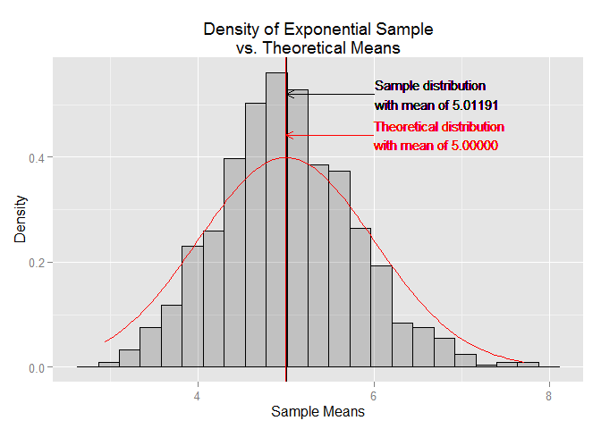
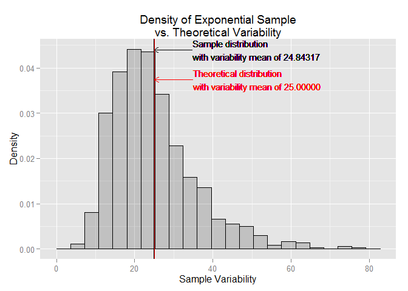
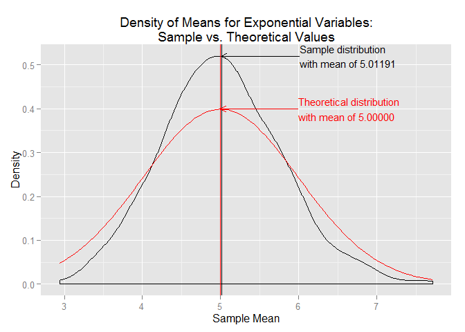

## Exponential Distribution Vs. the Central Limit Theorem

## Overview
This project explores the contrast between the observed and estimated means and variances of a large collection of randomly simulated exponential variables. This is achieved by comparing mean and variance values estimated by the Central Limit Theorem (CLT) to those observed through random simulation.

## Simulations

#### Load Required Libraries

```r
library(grid)       # Plotting graphics (arrow)
library(ggplot2)    # Plotting (ggplot etc.)
```


#### Set Variables and Simulate Data

```r
set.seed(123)
n <- 40
lambda <- 0.2
nSim <- 1000

exps <- NULL
means <- NULL
vars <- NULL

for (i in 1:nSim){
    exp <- rexp(n, lambda)
    exps <- cbind(exps, exp)
    means <- c(means, mean(exp))
    vars <- c(vars, sd(exp) ^ 2)
}

tMean <- 1 / lambda
tSD <- 1 / lambda
tSE <- tSD / sqrt(n)
tVar <- tSD ^ 2
```

The data were produced via 1,000 simulations (*nSim*) each generating 40 observations (*n*) of random exponentials using a rate of 0.2 (*lambda*). These values are applied via iteration of a loop to populate values of the expnonentials (*exps*), means (*means*) and variabilities (*vars*). 

Per the CLT both the estimated mean (*tMean*) and the estimated standard deviaion (*tSD*) are $(1/\lambda) = (1/0.2) = 5.0$.  Theoreteical standard error of the mean (*tSE*) is the standard deviation divided by the square root of the sample size = $\sigma / \sqrt{n} = 5.0 / \sqrt{1000} = .158$. Theoretical variance (*tVar*) is the square of the theoretical standard deviation $(5.0^2 = 25)$.  

## Sample Mean Vs. Theoretical Mean

1. Show the sample mean and compare it to the theoretical mean of the distribution.
Sample Mean versus Theoretical Mean: Include figures with titles. In the figures, highlight the means you are comparing. Include text that explains the figures and what is shown on them, and provides appropriate numbers.

 

## Sample Vaiance s. Theoretical Variance
 

## Distribution
Show that the distribution is approximately normal.
Focus on the difference between the distribution of a large collection of random exponentials and the distribution of a large collection of averages of 40 exponentials. 

Via figures and text, explain how one can tell the distribution is approximately normal.

 


The CLT states that averages are approximately normal, with distributions
centered at the population mean and 
with standard deviation equal to the standard error of the mean

Standard Error of the mean = 
SEm = sigma / sqrt(N)
